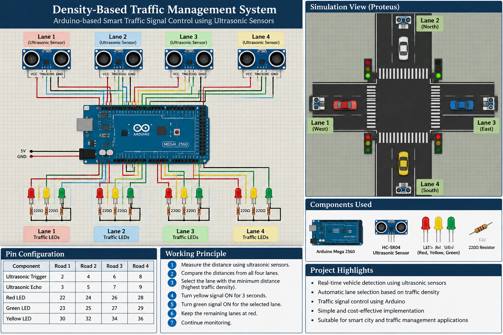

# Density-Based Traffic Management System

An Arduino-based traffic management system that uses ultrasonic sensors to detect the distance of vehicles in four lanes and controls the corresponding traffic signal LEDs based on the detected traffic density.

## Project Overview

This project was developed as a group project with friends to demonstrate a sensor-based approach to traffic signal management.

Four ultrasonic sensors are positioned at the back of four lanes. Each sensor measures the distance between itself and the nearest vehicle/object in its respective lane.

When the measured distance is smaller, it indicates that a vehicle is closer to the sensor and the lane is considered to have higher traffic density. The Arduino compares the distances from all four lanes and gives priority to the lane with the minimum measured distance.

## Objectives

- Detect vehicles using ultrasonic sensors.
- Monitor traffic conditions on four lanes.
- Estimate traffic density based on the distance of vehicles from the sensors.
- Automatically select the lane with the highest detected traffic.
- Control red, yellow, and green traffic signal LEDs using an Arduino.
- Demonstrate a simple embedded-system approach to traffic management.

## Hardware Used

- Arduino board
- 4 × Ultrasonic sensors
- 4 × Red LEDs
- 4 × Yellow LEDs
- 4 × Green LEDs
- Connecting wires
- Breadboard / project setup

## Software Used

- Arduino IDE
- Arduino C/C++

## Working Principle

The ultrasonic sensors are placed at the back of each lane and measure the distance to the nearest vehicle.

The basic principle is:

**Smaller distance → Vehicle is closer → Higher traffic density**

**Larger distance → Vehicle is farther → Lower traffic density**

The Arduino reads the distance from all four sensors and compares the readings. The lane having the minimum measured distance is selected as the active road.

The selected road undergoes a yellow-light transition for 3 seconds and then receives the green signal. The remaining roads remain at red.

## Working Flow

Ultrasonic Sensors  
↓  
Measure vehicle distance  
↓  
Read distances from 4 lanes  
↓  
Compare the measured distances  
↓  
Find the minimum distance  
↓  
Select that lane as the active road  
↓  
Yellow signal for 3 seconds  
↓  
Green signal for selected road  
↓  
Red signal for other roads  
↓  
Continue monitoring

## Pin Configuration

| Component | Road 1 | Road 2 | Road 3 | Road 4 |
|---|---:|---:|---:|---:|
| Ultrasonic Trigger | 2 | 4 | 6 | 8 |
| Ultrasonic Echo | 3 | 5 | 7 | 9 |
| Red LED | 22 | 24 | 26 | 28 |
| Green LED | 23 | 25 | 27 | 29 |
| Yellow LED | 30 | 32 | 34 | 36 |

## Control Logic

1. Read the distance from the ultrasonic sensor of each lane.
2. Store the measured distances.
3. Compare all four distance values.
4. Identify the lane with the minimum distance.
5. Treat that lane as having the highest detected traffic density.
6. Change its signal to yellow for 3 seconds.
7. Turn its green LED ON.
8. Keep the other lanes at red.
9. Continue monitoring the four lanes.
10. Update the active lane when another lane has a smaller measured distance.

## Source Code

The Arduino source code is available in the following file:

`traffic_management.ino`

The source code contains the implementation for:

- Ultrasonic sensor distance measurement
- Traffic-density selection
- Red, yellow, and green LED control
- Active-road selection

## Project Contribution

This was developed as a group project with friends.

I contributed to:

- Hardware setup
- Arduino board integration
- Ultrasonic sensor connections
- Traffic signal LED connections
- Testing and observation of the system

## Limitations

- The system uses vehicle distance as an indication of traffic density rather than directly counting vehicles.
- The current implementation supports four lanes.
- Ultrasonic sensor readings depend on the position and distance of vehicles.
- The current implementation does not use camera-based vehicle detection.
- The traffic decision is based on the minimum measured distance.

## Future Improvements

- Implement actual vehicle counting.
- Use multiple distance measurements to improve traffic-density estimation.
- Add adjustable green-signal timing based on traffic conditions.
- Add an LCD/OLED display for traffic information.
- Improve ultrasonic sensor error handling.
- Add IoT connectivity for remote monitoring.
- Extend the system for more complex road networks.

## Project Type

Embedded Systems | Arduino | Ultrasonic Sensors | Traffic Management
